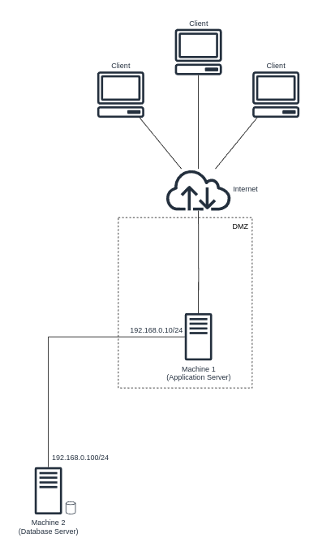
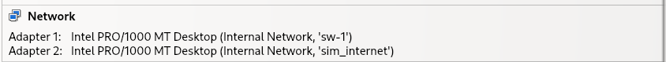

# A42 GrooveGalaxy Project Read Me

## Team

| Number | Name              | User                             | E-mail                                           | 
| -------|-------------------|----------------------------------| -------------------------------------------------|
| 99260  | José Cruz         | <https://github.com/JoseCruz2002>| <mailto:jose.melo.neves.cruz@tecnico.ulisboa.pt> |
| 110833 | Miguel Pato       | <https://github.com/miguel90210> | <mailto:miguel.pato@tecnico.ulisboa.pt>          |
| 99329  | Simão Silva       | <https://github.com/Simons36>    | <mailto:simao.santos.silva@tecnico.ulisboa.pt>   |

  

*(add face photos with 150px height; faces should have similar size and framing)*

## Contents

This repository contains documentation and source code for the *Network and Computer Security (SIRS)* project.

The [REPORT](REPORT.md) document provides a detailed overview of the key technical decisions and various components of the implemented project.
It offers insights into the rationale behind these choices, the project's architecture, and the impact of these decisions on the overall functionality and performance of the system.

This document presents installation and demonstration instructions.

*(adapt all of the following to your project, changing to the specific Linux distributions, programming languages, libraries, etc)*

## Installation

To see the project in action, it is necessary to setup a virtual environment, with N networks and M machines.  

The following diagram shows the networks and machines:



### Prerequisites

All the virtual machines are based on: Linux 64-bit, Debian 12.4.0

[Download](https://cdimage.debian.org/debian-cd/current/amd64/iso-cd/debian-12.4.0-amd64-netinst.iso) and [install](vm_install_tutorial.md) a virtual machine of Debian 12.  
Clone the base machine to create the other machines.


### Machine configurations

For each machine, there is an initialization script with the machine name, with prefix `init-` and suffix `.sh`, that installs all the necessary packages and makes all required configurations in the a clean machine.

Inside each machine, use Git to obtain a copy of all the scripts and code.

```sh
$ git clone https://github.com/tecnico-sec/a42-miguel-jose-simao.git
```

Next we have custom instructions for each machine.

>__NOTE__: You should have configured two separate "internal networks" in virtual box: One to simulate the connection of the application server to the database server and another one to simulate the internet and to connect the client to the app server. There will be pictures below showing this.

#### Machine 1

Please do the [sftp configuration tutorial](./sftp-configuration.md) so that musics can be transferred via SFTP from app server to database server.

##### Network Config:


This machine runs

*(describe what kind of software runs on this machine, e.g. a database server (PostgreSQL 16.1))*

To verify:

```sh
$ setup command
```

*(replace with actual commands)*

To test:

```sh
$ test command
```

*(replace with actual commands)*

The expected results are ...

*(explain what is supposed to happen if all goes well)*

If you receive the following message ... then ...

*(explain how to fix some known problem)*

#### Machine 2

This machine runs MySql, version 8.0.35. The MySql database 

To verify:

```sh
$ setup command
```

*(replace with actual commands)*

To test:

```sh
$ test command
```

*(replace with actual commands)*

The expected results are ...

*(explain what is supposed to happen if all goes well)*

If you receive the following message ... then ...

*(explain how to fix some known problem)*


## Demonstration

Now that all the networks and machines are up and running, ...

*(give a tour of the best features of the application; add screenshots when relevant)*

```sh
$ demo command
```

*(replace with actual commands)*

*(IMPORTANT: show evidence of the security mechanisms in action; show message payloads, print relevant messages, perform simulated attacks to show the defenses in action, etc.)*

This concludes the demonstration.

## Additional Information

### Links to Used Tools and Libraries

- [Java 8](https://openjdk.java.net/)
- [Maven 4.0.0](https://maven.apache.org/)
- [MySql](https://www.mysql.com/)
- [Mysql Java Connector](https://mvnrepository.com/artifact/com.mysql/mysql-connector-j)
- [Apache Commons DBCP2](https://mvnrepository.com/artifact/org.apache.commons/commons-dbcp2) (Database Connection Pool)
- [jsch](https://github.com/mwiede/jsch) SFTP Library

### License

This project is licensed under the MIT License - see the [LICENSE.txt](LICENSE.txt) for details.

*(switch to another license, or no license, as you see fit)*

----
END OF README
