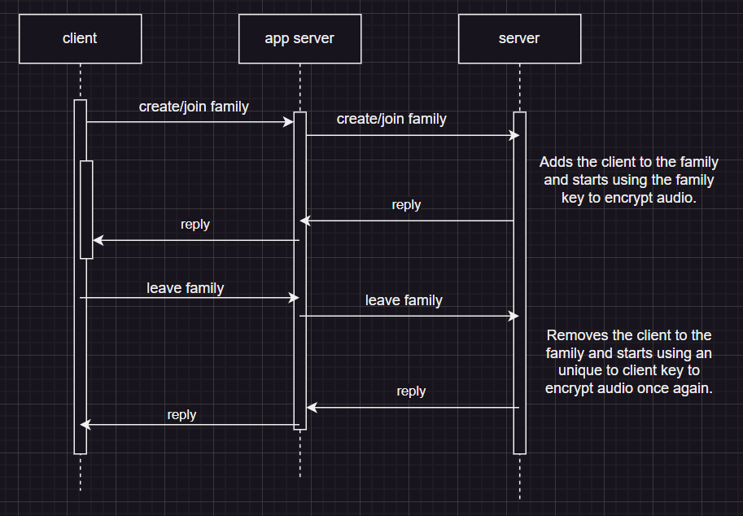

# A42 GrooveGalaxy Project Report

## 1. Introduction

**GrooveGalaxy** is an online music store that sells songs in a custom format.
GrooveGalaxy allows users to search and browse through a wide range of songs, artists, and genres. The ability to preview songs is particularly helpful, ensuring that consumers only purchase music that resonates with them. Once they decide to buy, the process is seamless, offering choices in file formats like WAV or FLAC, suitable for various devices.
GrooveGalaxy offers a personal account feature, enabling users to manage their purchases and preferences. It even tailors music recommendations based on listening history. This store effectively caters to the needs of music lovers, combining convenience, variety, and personalization.

The data handled in transactions in GrooveGalaxy is media files that come in JSON format (More on that on section 2.1). To protect this documents a cryptographic library was developed. The protected document must ensure the authenticity of the song data.
Additionally, it must also ensure that only the owner can listen to the song, i.e., the content is confidential and accessible only to the owner.

The planned infrastructure has a set of separate (virtual) machines, with network isolation, namely: one database server; one application server, exposing an API; a client machine, to access the application server (Image of the infrastructure below).


The database implemented stores information about the users (username, hashed password, and both their temporary and permanent keys), the media (Title, artist, genre, lyrics and the path to the media file that is stored in the host machine) and finally information about families (security challenge). 

The application server accesses the database and performs CRUD operations (Create, Read, Update, Delete). These operations are made available to clients, by an application programming interface (API).

Our security challenge was:
- To use cryptography options that allow playback to quickly start in the middle of an audio stream, optimizing user experience without compromising security.
- Add the concept of family sharing, where individual users can be members of the same family, and a protected song should be accessible to all family members without modification. Each user still only has its own key, so, some dynamic key distribution was devised.

## 2. Project Development

### 2.1. Secure Document Format

#### 2.1.1. Design

We designed this Cryptographic Library to support the use of **two keys**: 
* A **temporary key**, that will encrypt the audio, and be used for a **certain amount of time**
* A **permanent key**, that will be used to **encrypt** this temporary key (we then send the encrypted temporary key to the user)

Our Cryptographic Library offers two separate APIs for both servers and clients. Below you will see a description of these two APIs:

* The ***CryptographicLibraryServerAPI*** offers, among other methods, the ***Protect*** method, that takes a music in a JsonObject in [this format](img/json_original.png), and returns a struct called ***ProtectReturnStruct***. The ProtectReturnStruct has the following fields:
  - encryptedContent
  - iv
  - digitalSignature
  - tempKeyEncrypted

    What happens is that Protect gets the `audioBase64` field from the provided json, converts it to byte[], and **encrypts** it using a created **initialization vector** (iv) and the **user's current temporary key** (the iv used is 128 bits long: the first 64 are random and the last 64 are all 0. This is because we use **AES** with **CTR** mode; this will be explained below). <br>

    Then, we convert the encrypted bytes back to base64 and replace the `audioBase64` field with this. Aditionaly, for protection against **replay attacks** and to ensure **freshness**, we add a field to the Json called `nonce`, and add a large nonce concatenated with a timestamp for the client to verify. Now we can convert the Json to byte[] (this corresponds to the _encryptedContent_ part of the **ProtectReturnStruct**). <br>

    Finally, we set the _iv_ parameter of the ProtectReturnStruct as the _iv_ used and the **tempKeyEncrypted** field with the used **temporary key** for this document encrypted with the **permanent secret key** for this user (this "permanent secret key" is a KEK (key encrypting keys), and its the secret value that is shared between clients and server from the beggining). To create the digitalSignature, we concatenate the byte arrays of encryptedContent, iv and tempKeyEncrypted and sign it with the server's private key (insuring integrity in these three fields).

* The **CryptographicLibraryClientAPI** offers, among other methods, the **Check** and **Unprotect** methods:
  * The Check method will verify **integrity** of a received ProtectReturnStruct (using the digital signature in that ProtectReturnStrcut).
  * The Unprotect method will receive a ProtectReturnStruct, **decrypt** the temporaryKeyEncrypted with the *permanent key*, and use it to decrypt the `audioBase64` of the JsonReceived (it needs to reconstruct the json from bytes). Finally, it will check for freshness and repeated messages in the `nonce` field of the Json.
  

#### 2.1.2. Implementation

The cryptographic library was implemented in Java and is essencially made up of two big parts:
- An API for the GrooveGalaxy client to use and another for the application server to use;
    - This is done by having two classes, one for each API, those classes being `CryptographicLibraryClientAPI` and `CryptographicLibraryServerAPI`;

- A CLI with the following commands:
    - ```console Protect``` - Protects a JSON file, using the given secret key to encrypt with AES and CTR, and the private key to sign the encrypted content and create a digital signature. The results are written to the given path. Usage:
        - ```console crypto-lib protect <path-to-json> <path-to-secret-key> <path-to-private-key> <path-to-write-results> <filename>```

    - ```console Unprotect``` - Unprotects the given encrypted JSON file, using the permanent secret key to decrypt with AES and CTR. Also checks for freshness and replay attacks (latter not available using CLI). The decrypted file is written to the given path. Usage:
        - ```console crypto-lib unprotect <path-to-encrypted-json> <path-to-iv> <path-to-permanent-secret-key> <path-to-temporary-secret-key> <seconds-to-expire> <path-to-write-results> <filename>```
    
    - ```console Check``` - Checks if the given encrypted JSON file is valid, using the given IV, digital signature, and public key to verify the digital signature. Returns true if the file is valid, false otherwise. Usage:
        - ```console crypto-lib check <path-to-encrypted-json> <path-to-iv> <path-to-encrypted-temp-key> <path-to-digital-signature> <path-to-public-key>```

    - ```console Generate-key``` - Generates a new temporary secret key and writes it to the given path. Usage:
        - ```console crypto-lib generate-key <path-to-store-key> <name-of-the-user>```

**Libraries used** <br>
- `java.security:` utilized for cryptographic operations in the provided Java code. It includes key handling with `java.security.PrivateKey` and `javax.crypto.SecretKey`, along with key-related operations using KeyFactory and specifications like SecretKeySpec. Digital signatures are created through `java.security.Signature` with the private key. Additionally, random number generation is facilitated by `java.security.SecureRandom`.
- `javax.crypto:` The package is employed for cryptographic functionalities in the Java code. It involves encryption and decryption operations through the `javax.crypto.Cipher` class. Different cryptographic algorithms and modes are specified, such as "AES/CTR/NoPadding." Initialization vectors (IVs) are managed using `javax.crypto.spec.IvParameterSpec`, and secret keys are constructed with `javax.crypto.spec.SecretKeySpec`. The code also utilizes `javax.crypto.EncryptedPrivateKeyInfo` for handling encrypted private keys. Specifically, **CryptoOperations** class within javax.crypto performs symmetric encryption and decryption operations, while **KeyOperations** class handles the creation of temporary keys. The key encryption and decryption with a password are achieved using Cipher and SecretKeyFactory from javax.crypto. The **PasswordHash** class within `javax.crypto.spec` deals with password-based key derivation using the PBKDF2 algorithm.
- `java.util.Base64`: class in the provided Java code is used for encoding and decoding binary data to and from Base64 representation. It facilitates the conversion of byte arrays to Base64 strings and vice versa. This functionality is applied in encrypting/decrypting audio content, creating digital signatures, and encoding/decoding nonces and keys, ensuring safe representation in text-based formats like JSON.

**Challenges**


### 2.2. Infrastructure

#### 2.2.1. Network and Machine Setup

The netwwork infrastructure has a set of separate (virtual) machines, with network isolation, namely:
- One database server;
- One application server, exposing an API;
- A client machine, to access the application server.

**Client Machine**

The client machine is connected to our application server via the Internet. The user has a simple command line interface to make requests. The commands available and their usage are specified by typing the command `help`. The request are made using Grpc with SSL/TLS so that the client authenticates himself towards the server and the server authenticates itself towards the client. The client has the server certificate in its secure trust store from the get go.

**Application Server**

The application server communicates with the client by having a Grpc server running to receive the requests and reply to the client. As stated above, the channel is protected using SSL/TLS configuration. The server has the certificates of the clients from the start. We used Grpc due to our familiarity with it

**Database Server**

(_Provide a brief description of the built infrastructure._)
(_Justify the choice of technologies for each server._)

#### 2.2.2. Server Communication Security

(_Discuss how server communications were secured, including the secure channel solutions implemented and any challenges encountered._)

(_Explain what keys exist at the start and how are they distributed?_)
A secret key was shared at the beggining by the application server and the each client, this is the permanent key that we then use to encrypt the temporary keys that are used to encrypt the audio. The temporary keys are renewed by the database server and this operation does not require any behaviour changes in the client. This renewal is made from time to time and affects all keys.

The certificates to authenticate the clients and application server are already manually distributed by us from the beggining.

### 2.3. Security Challenge

#### 2.3.1. Challenge Overview

For the security challenge, we firstly had to allow the client to be able to play music from the middle of the song, i.e. the client must be able to hear the song, even only receiving part of the audio. The second part of teh challenge was to create the concept of a family. When a user belongs to a family he gains access to all the songs that any member of that family also has access to.

#### 2.3.2. Attacker Model

The Database server is considered to be fully trusted, it is protected by a firewall in our private network and the ideia was that the data was totally encrypted.

The application server is only considered to be partially trusted. It is in a DMZ as it has to be connected to the Internet and is exposed to DMZ exploitation by an attacker outside our network.

The client application is considered to be untrusted as they connect via Internet, i.e. their communication comes from external networks, which introduces a higher level of exposure to potential security threats and unauthorized access. Despite having a server trust store that holds the certificates of the clients to authenticate them, if an attacker is able to make the application server trust him, he can perform requests to the server as any other.

We always use the same symetric key to encrypt the temporary keys that in turn encrypt the audio. By always using the this same "permanent" key by user we expose the application to cryptoanalysis to discover this key. In the possession of this key, malicious actor is able to decrypt all the communication, just having to listen to it. To solve this we could use a mechanism to change this permanent key from time to time, this is not implemented however.

However, an attacker can never impersonate another user without having his password and a trusted certificate.

Without obtaining the permanent key, which is no easy task, as it is only used to encrpyt another key, an attacker can not hear any audio by sniffing the communication headed towards another client. 

If a malicious hacker gains access to a victim computer and can access the victim's file system then he has access to the audio that the victim has downloaded. We understand that this is a vulnerability and planned to fix it by having the client storing the audio in an encrypted fashion whilst also storing the temporary key to decrypt it in his secured key store; the id of the temporary key and the iv would be stored in the stored song document. 

#### 2.3.3. Solution Design and Implementation

For the first part of the security challenge, allow a client to playback music from a middle point we had to ensure that the client is able to decrypt the audio file without rreceiving all the encryped bytes. This means that the client must be able to, when **Unprotecting** a received song document, although the server encrypts the hole of the audio bytes and only starts sending from a certain block of the cyphered bytes, the client must get a song document with the correct decrypted audio.

To do this, our symetric keys used to encrypt the audio use the **CTR** block encryption mode. In this mode, the blocks are encrypted individually of one another, they are not chained, i.e. the encryption of block **n** does not depend on the encryption of block **n-1**. Therefore the decryption of block **n** does not depend on the decryption of block **n-1**. This allows us to choose from which block we will send the audio, and the client has no problems listening to it.

For the second step of the seccurity challenge, creating the notion of family, the client implementation barely had to change. When a client started to belong to a certain family, either by creating or joining it, the database adds the client to either a new family or an existing one, depending whether the client is creating or joining. With this, the server starts to use the family temporary/session key to encrypt the audio everytime a client request a song, with this family key being encrypted using the permanent key shared by the client and the database. This is seameless to the client, the new family key is simply used in place of the session key (we call it temporary key throughout the code). If a client decides to leave a family, the behaviour is very similar, the database removes the client from the family he was in and starts using a unique key to that user to encrypt the audio as previouly.

UML sequence diagram:



## 3. Conclusion

**Achievements**
We managed to develop a secure working application like the one described in the project scenario, managing to succesfully develop a cryptographic library that allows the protection of the GrooveGalaxy document format. In addition to this we also met the infrastructure and server communication security requirements.

**Requirements Satisfied**
The requirements that were **satisfied** were:
- The development of a cryptographic library that allows the protection of the GrooveGalaxy document format. That has all the required operations (Protect, Unprotect, Check) that is used for GrooveGalaxy but also as a CLI that can be used.
- The communication with the servers is secure, all the necessary keys were generated and distributed. The communication is done using TLS.
- The part of the security challenge regarding the families was successfully implemented.
- All the features described in the project scenario were implemented and are supposedly working, except for streaming which is missing parts for it to work.

The requirements that were **not satisfied** were:
- The database isn't encrypted. Cipher data at rest was not implemented due to lack of time.
- The streaming a song was also not implemented but the way we implemented encryption allows for this feature to be added. Our solution was to use an UDP connection to send the audio block by block, the key and IV used to decrypt the audio would be sent securily through the Grpc connection.
- We were unable to correctly deploy a firewall infrastructure to protect the application server and the database server of outside attackers.
- The song's audio is not stored in an encrypted way at the client machine.


**Future Work**
- Implement the missing features, namely the streaming of a song and the cipher data at rest.

**Lessons Learned**
This project provided valuable insights and practical lessons. The experience reinforced key concepts and skills, such as:
- **Cryptographic implementation**: Developing a cryptographic library required a understanding of encryption, digital signatures, and key management, translating theoretical knowledge into practical applications.
- **Secure Coding Practices**: Writing secure and robust code became paramount to ensure the integrity and confidentiality of sensitive information. Adhering to best practices mitigated potential vulnerabilities
- **Key Management Strategies**: Handling permanent and temporary keys underscored the importance of effective key management.
- **Secure Communication Channels**: Implementing secure communication channels between servers and clients required a thorough understanding of the underlying concepts and the ability to apply them in practice.

In conclusion, the project served as a comprehensive exploration of cryptographic principles and their real-world applications. The hands-on experience not only solidified theoretical knowledge but also provided practical insights into the complexities of secure system development. This project has been instrumental in bridging the gap between academic concepts and their practical implementation, preparing us for challenges in the dynamic field of network and computer security.

## 4. Bibliography
- Stack Overflow. (Year). Stack Overflow: Where Developers Learn, Share, and Build Careers. [Stack Overflow](https://stackoverflow.com/)
- Tecnico-Sec. (2023). Técnico Network and Computer Security course. [GitHub](https://github.com/tecnico-sec)
----
END OF REPORT
