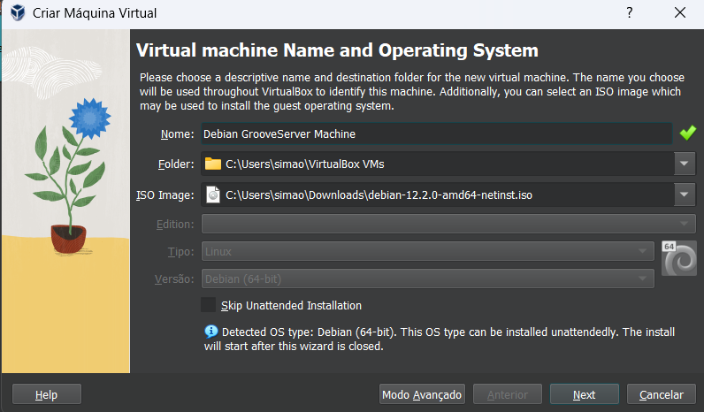
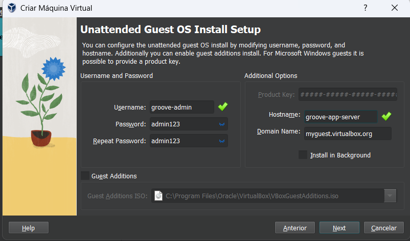
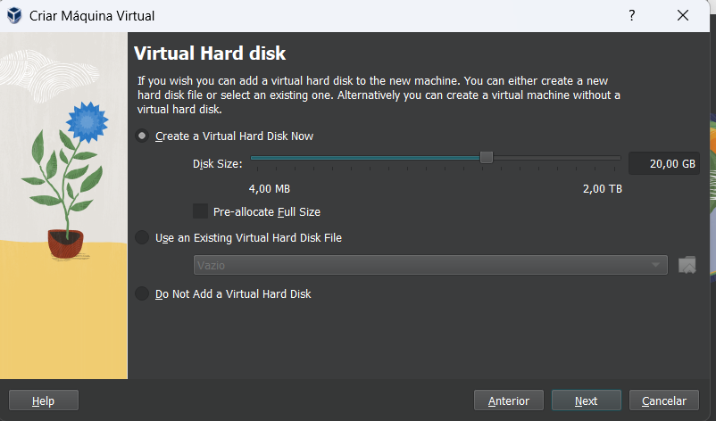

# Debian Net Install Tutorial

* First download the iso (link in the [README](README.md) file)
* Open Virtual Box
* Click `New` to create a new **virtual machine**
* You need to select the iso you have just downloaded in the `ISO Image` box: 

* Next you need to set the **username**, **password** and **hostname**

* Next select processor cores and RAM available to vm (do this based on yoour computer's capacity)
* Define disk capacity (20 GB is more than enough):

* Click **next** and wait for the machine to launch
* After you Debian installs and you complete the final steps of the instalation 